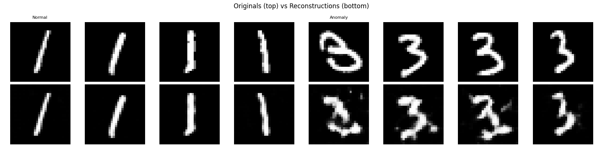
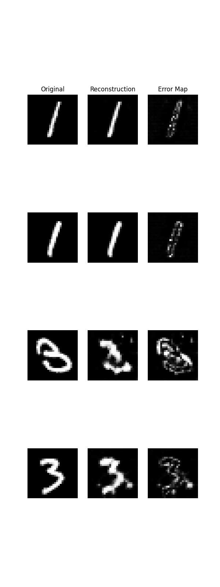
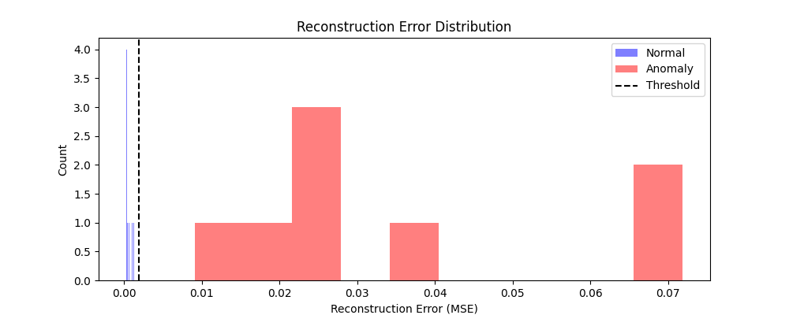

# MNIST Anomaly Detection

A reconstruction-based anomaly detection system built with a Convolutional Auto-encoder, trained on normal MNIST digit classes and evaluated on unseen anomalous classes.

## 🎯 Goal
Train a model exclusively on one digit class (e.g. digit "1") and detect all other digits as anomalies, using reconstruction error as the anomaly score.

## 🧠 Method
- **Architecture:** Convolutional Auto-encoder (CAE)
- **Anomaly Score:** Mean Squared Error (MSE) between input and reconstruction
- **Evaluation:** AUC-ROC, F1-Score

## 📁 Project Structure
```text
mnist-anomaly-detection/
├── models/
│   └── autoencoder.py       # CAE architecture
├── tests/
│   └── test_autoencoder.py  # Shape validation tests
├── train.py                 # Training on normal class only
├── evaluate.py              # Anomaly scoring and metrics
├── visualize.py             # Reconstruction error maps
├── config.py                # Hyperparameters
├── environment.yml          # Conda environment definition
└── README.md
```

## 🚀 Getting Started

### 1. Clone the repository
```bash
git clone [https://github.com/Fh-Hosseini/mnist-anomaly-detection.git](https://github.com/Fh-Hosseini/mnist-anomaly-detection.git)
cd mnist-anomaly-detection
```

### 2. Create and activate environment
```bash
conda env create -f environment.yml
conda activate mnist-anomaly-detection
```

### 3. Train the model
```bash
python train.py
```

### 4. Evaluate
```bash
python evaluate.py
```

### 5. Visualize
```bash
python visualize.py
```

## 📊 Results

| Metric | Score |
|--------|-------|
| AUC    | 0.9988 |
| F1     | 0.9939 |

### Reconstructions
Normal digits (top) reconstruct accurately. Anomalous digits (bottom) reconstruct poorly.



### Error Maps
Error maps show pixel-level reconstruction error. Normal images produce nearly black maps. Anomalous images produce bright, noisy maps.



### Reconstruction Error Distribution
Normal errors cluster near zero. Anomalous errors spread across higher values. The threshold separates the two distributions cleanly.




## 🔧 Requirements
All dependencies are managed via `environment.yml`. Ensure you have **Conda** or **Miniconda** installed to set up the environment.

---
*This project is part of my preparation for a Master's thesis on anomaly detection in 3D lung CT scans.*